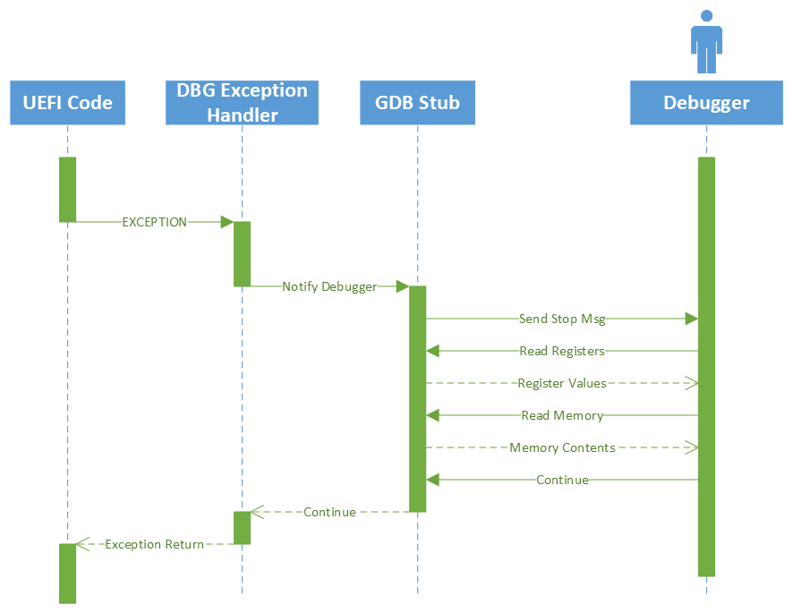
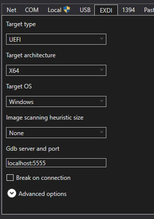
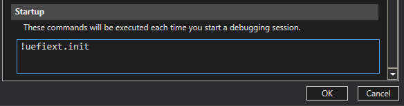

# Debugger Feature Package

This package contains implementations and tools for a UEFI software debugger. This
implementation will expose a GDB server over the provided transport implementation.
This GDB server can be debugger using Windbg, GDB, or other debuggers that support
the [GDB Remote Protocol](https://sourceware.org/gdb/current/onlinedocs/gdb.html/Remote-Protocol.html).

The debugger functions by installing exception handlers that are invoked on common
exceptions as well as debug specific interrupts. Once in the exception handler,
basic information is collected from the architecture and phase specific implementations
and control is handled off to the GDB stub which communicates with the debugger over
a physical transport.

Once in the exception and the debugger is "broken in" then the debugger may send
requests to the GDB stub to query or change device information, memory state,
register values, etc. After resuming from the debugger the exception will return
to executing back into the original code.



One important detail about this debugger implementation is that it takes no core
dependence on protocols or modules other then the core. This also means that it
does not leverage several existing protocols such as the DEBUG_SUPPORT_PROTOCOL.
This is a intentional design choice to ensure that the debugger is as self-sufficient
as possible so that it can be available as early as possible. In cases where the
debugger initializes on libraries or custom implementations such as for page table
walks or exceptions handlers, it will attempt to use the protocols once available
for consistency.

## Supported Functionality

The following functionality is supported by the UEFI Debugger.

| Feature                          | State        | Notes                             |
|----------------------------------|--------------|-----------------------------------|
| Memory Read/Write                | Supported    | |
| General Purpose Register R/W     | Supported    | |
| Instruction Stepping             | Supported    | |
| Interrupt break                  | Supported    | |
| System Register Access           | Partial      | Partially supported read through monitor commands |
| SW Breakpoints                   | Supported    | |
| Watch points / Data Breakpoints  | Supported    | |
| HW Breakpoints                   | Unsupported  | Not currently needed with SW breakpoints |
| Break on module load             | Supported    | Supported through monitor command |
| Reboot                           | Supported    | Supplemented with monitor command for better use |
| UEFI Variable Access             | Planned      | Planned support by monitor command |
| Multithread Support              | Planned      | Currently only exposes the BSP thread/core |

## Enabling the debugger

The [DebugAgent library](./Library/DebugAgent/) implements the debug logic and is
designed to be added only to the core binary for a given phase of UEFI. The debug
agent should be directly added to the core as demonstrated below.

```ini
MdeModulePkg/Core/Dxe/DxeMain.inf {
  <LibraryClasses>
    DebugAgentLib|DebuggerFeaturePkg/Library/DebugAgent/DebugAgentDxe.inf
}
```

The debug agents will check for the [Debug HOB](./Include/DebuggerControlHob.h) to determine
if the debugger should be enabled or not. A platform may choose to create this
hob based on its own configuration system or it can use the [DebugConfigPei](./DebugConfigPei/DebugConfigPei.c)
module to tie debug enablement to the `DEVICE_STATE_SOURCE_DEBUG_ENABLED` Device
State flag. If a platform is creating the HOB through other means, careful consideration
should be taken to ensure that the debugger cannot be enabled in secure scenarios.

If the platform has a watchdog that will expire then the platform should implement
the [WatchdogTimerLib](./Include/Library/WatchdogTimerLib.h) to allow the debugger
to pause the timer while broken in on exceptions.

## Debug Transport

The UEFI software debugger uses the [DebugTransportLib](./Include/Library/DebugTransportLib.h)
to abstract the physical transport used to communicate with the debugger. Currently,
a basic [serial port implementation](./Library/DebugTransportSerialLib/DebugTransportSerialLib.c)
is provided but platforms may use this abstraction to support different transports
or support multiple serial ports in the case of dedicated debug ports.

### Serial Transport Contention

DebugTransportSerialLib uses the same serial transport as the debuglib and advanced
logger. Output on that serial port while the debugger is broken in will likely confuse
the debugger application when it receives the debug log output when it expects a
response to it's queries. Additionally, the serial console input may eat break
instruction from the debugger. For this reason, the platform should implement a
version of the [TransportLogControlLib](Include\Library\TransportLogControlLib.h)
to allow the debugger to squelch log output while broken in.

Additionally, if using TerminalDxe.inf this will need to be disabled or else the
console output may confuse the debugger application.

## Debugging with Windbg

Windbg can attach to the GDB port exposed by the debugger using the [Windbg EXDI
GDB Server](https://learn.microsoft.com/en-us/windows-hardware/drivers/debugger/configuring-the-exdi-debugger-transport).

This currently only supports debugging over a TCP port, if the machine is connected
over a serial device or named pipe, see the [Serial to TCP forwarding section](#serial-to-tcp-forwarding).

>NOTE: The metadata in ExdiConfigData.xml required for automatically connecting
to UEFI debug sessions is not yet merged into Windbgx and will need to be manually
added for the time being. See [Customizing EXDI Configuration](#customizing-exdi-configuration)
for more information.

### Launching from UI

You can attach to the UEFI debugger from the windbgx UI. Press Ctrl-K to get to
the kernel debugger options, and click on the EXDI tab. From there you can can select
the UEFI option, the appropriate architecture, Windows (not used), "None" for
Image scanning heuristics size, and select the correct IP and port. This requires
Windbgx version 1.2404.22002.0 or newer.



### Launching from command line

Windbg can attach to the GDB port exposed by the debugger using the [Windbg EXDI
GDB Server](https://learn.microsoft.com/en-us/windows-hardware/drivers/debugger/configuring-the-exdi-debugger-transport).
For recent builds of windbg this can be invoked using the following command from
and administrator prompt. Since only the most recent windbgx builds will have the
configuration by default, you can provide the PathToSrvCfgFiles path as shown before
to load the config from the included [exdiConfigData.xml](../Scripts/exdiConfigData.xml).

```cmd
Windbgx -v -kx exdi:CLSID={29f9906e-9dbe-4d4b-b0fb-6acf7fb6d014},Kd=Guess,Inproc=ExdiGdbSrv.dll,DataBreaks=Exdi,PathToSrvCfgFiles=PATH_TO_MU_FEATURE_DEBUGGER_REPO\Scripts\
```

Note that this by default is configured to use the port `5555`. Also running the
above from PowerShell might leads to issues as PowerShell will interpret the brackets
in the guid as language components rather then passing them as arguments to Windbgx.

### Customizing EXDI Configuration

Windbg relies on a configuration file to connect to GDB servers and to decode their
register state. This is configured in a file named `exdiConfigData.xml` which
details all the supported GDB targets and heir configuration information. This file
can be found in the Windbg installation folder. If the UEFI section does not exist
it can be added from the the XML file found [here](Scripts/exdiConfigData.xml).
This data can be changed depending on port, register, or diagnostics changes desired.

### UEFI Symbols in Windbg

To enable loading symbols automatically windbg will need to be made aware of the
symbols path for the UEFI image. This can be done by adding the PDB directory from
the UEFI build to windbg's symbols path.

```console
.sympath+ C:\project\build\PlatformPkg\PDB
```

After adding symbols the [Windbg UEFI Extension](#uefi-extension) can be used to
resolve the loaded binaries, notable the `!uefiext.findmodule` and `!uefiext.findall`
commands.

Currently GCC builds do not generate PDB files. This is planned for future work,
but currently windbg will not be able to resolve GCC symbols.

### UEFI Extension

This package contains an [Windbg Extension for Windbg](../UefiDbgExt/) that
can be used to access UEFI structures and interact with the UEFI software debugger
in a more intuitive way. See the the extensions [readme.md](../UefiDbgExt/readme.md)
for more details. You can run this powershell command to install the latest version
of the extension.

```console
wget -Uri https://github.com/microsoft/mu_feature_debugger/releases/latest/download/uefiext.dll -OutFile C:\Users\$Env:UserName\AppData\Local\DBG\EngineExtensions\UefiExt.dll
```

It is advised to configure `!uefiext.init` as a startup action in
Settings->Debugging Settings->Startup. This will attempt to detect and automatically
resolve initial symbols when connecting.



### Serial to TCP forwarding

Windbg currently only supports connecting to the TCP based GDB server. To be able
to support COM and named pipe based transports, this package contains a
[ComToTcpServer.py](../Scripts/ComToTcpServer.py) script to forward traffic between
a serial device and a TCP server. This can also be useful if the user would like
to debug from a different machine then is connected to the device. For details on
full use run `python3 ComToTcpServer.py --help`. A couple common example invocations
are provided below.

```console
# Forwards a device running on COM5 at baud rate 115200 to the TCP port 5555
Python3 ComToTcpServer.py -c COM5 -b 115200 -p 5555

# Forwards a named pipe device to TCP port 5555
Python3 ComToTcpServer.py -n \\.\pipe\uefidbg -p 5555
```

After the script has started you can connect the debugger making sure that the port
used is the same as the port specified in the `exdiConfigData.xml` mentioned above.

This script requires the `pyserial` and `pywin32` modules to access the Windows
COM and named pipe devices.

## Debugging with GDB

GDB is currently only functional with AARCH64 due to bugs in the x64 features files.
To connect to the GDB server, launch GDB with the following command.

```sh
gdb-multiarch -ex "target remote localhost:5555" -ex "source MU_FEATURE_DEBUGGER/BaseTools/Scripts/efi_gdb.py"
```

`target remote localhost:5555` will attach to the GDB port and
`source MU_FEATURE_DEBUGGER/BaseTools/Scripts/efi_gdb.py` will load symbols from a local
build and add some UEFI commands. The target command can be altered for port, or
device as needed.

To debug the debugger in GDB, you can add `-ex "set debug remote on"` to the beginning
for verbose prints on the packets sent and received between GDB and the stub.

### Debugging in VS Code

To connect to GDB from within VS Code, you can use the following launch configuration
using the [C/C++ Extension](https://marketplace.visualstudio.com/items?itemName=ms-vscode.cpptools).

```json
{
  "name": "UEFI Debugger",
  "type": "cppdbg",
  "request": "launch",
  "program": "${workspaceRoot}/Build/QemuSbsaPkg/DEBUG_GCC5/AARCH64/MdeModulePkg/Core/Dxe/DxeMain/DEBUG/DxeCore.debug",
  "miDebuggerServerAddress": "localhost:5555",
  "cwd": "${workspaceRoot}",
  "environment": [],
  "MIMode": "gdb",
  "miDebuggerPath": "gdb-multiarch",
  "stopAtConnect": true
},
```

Note that the `program` value is just to satisy the extension. It must be a valid
application, but will not matter for the actual debugging.

After connecting, run `-exec source MU_FEATURE_DEBUGGER/BaseTools/Scripts/efi_gdb.py` from
the `DEBUG CONSOLE` tab to load symbols. This will require that the debugger be
stepped or executed before the symbols will take place.

### Debugging in gdbgui

You can also use other GUI implementations for GDB if desired. One tested option
is the gdbguid python module. This can be installed by running `pip install gdbgui`
and can be launched into the debugger using the following command where the remote
can be changed as appropriate.

```sh
# AARCH64
gdbgui -g "gdb-multiarch -ex 'target remote localhost:5555' -ex 'source MU_FEATURE_DEBUGGER/Scripts/efi_gdb.py'"
# X64
gdbgui -g "gdb -ex 'target remote localhost:5555' -ex 'source MU_FEATURE_DEBUGGER/BaseTools/Scripts/efi_gdb.py'"
```

## Custom GDB Server Commands

The GDB protocol allows for locally interpreted commands using the `qRcmd,command`
where the command is a hex encoded data. The UEFI software debugger has implemented
the following commands. Many of these commands are abstracted by the
[Windbg Extension](#uefi-extension). in GDB these can be sent by running
`monitor <command>`.

| Command          | Function                                               | Example    |
|:-----------------|:-------------------------------------------------------|:-----------|
| ? | Get information about the UEFI debug environment. | ? |
| m*INDEX* | Read the MSR at the provided index in HEX | m08B |
| M*INDEX*:*Value* | Write the MSR at the provided index in HEX with provided HEX value | M08B:0FFFF |
| v{*GUID*}:*NAME* | Read the variable with the GUID and NAME. If GUID is empty, assume global. | v{8BE4DF61-93CA-11D2-AA0D-00E098032B8C}:BootOrder|
| V{*GUID*}:*NAME*:*VALUE* | Write the variable with the GUID and NAME. If GUID is empty, assume global. The value is in HEX. | V:BootOrder:00|

These can be manually run from Windbg by using `.exdicmd target:0:COMMAND` where
COMMAND is desired the command from above.

## Copyright

Copyright (C) Microsoft Corporation. All rights reserved.

SPDX-License-Identifier: BSD-2-Clause-Patent
